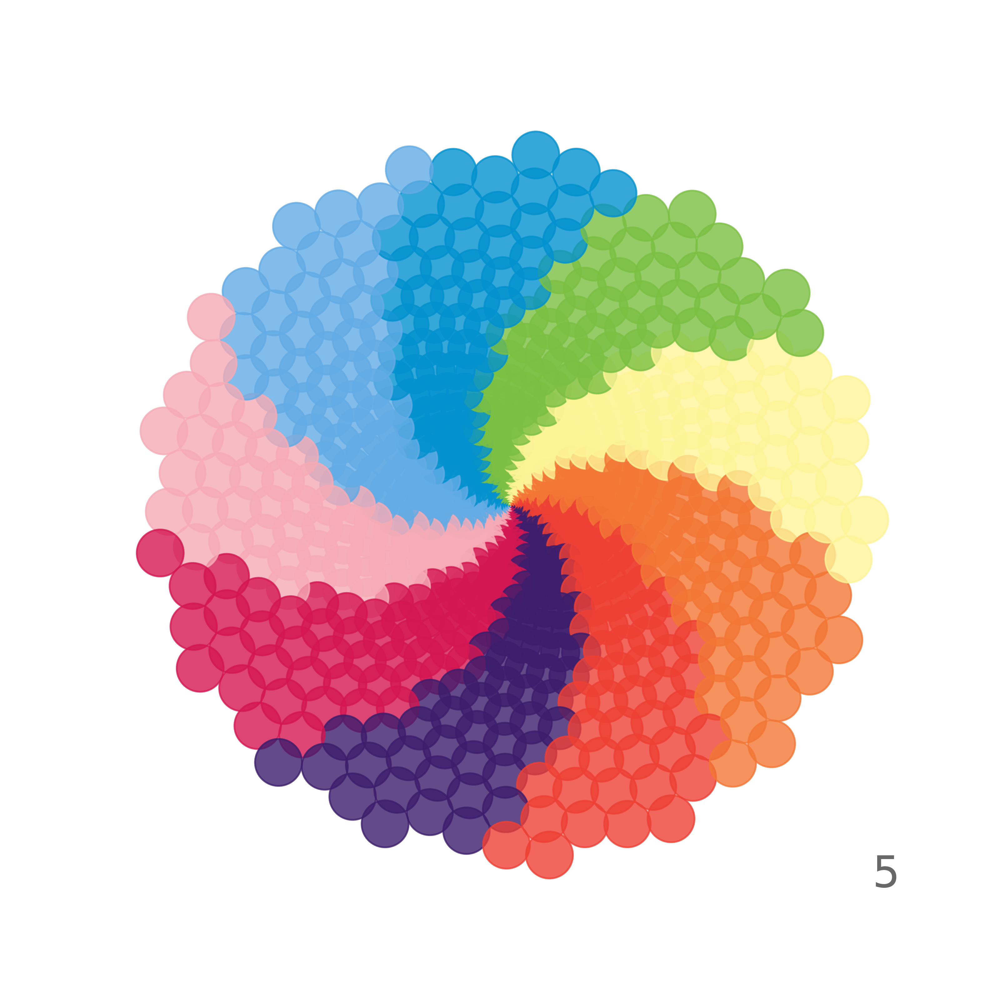
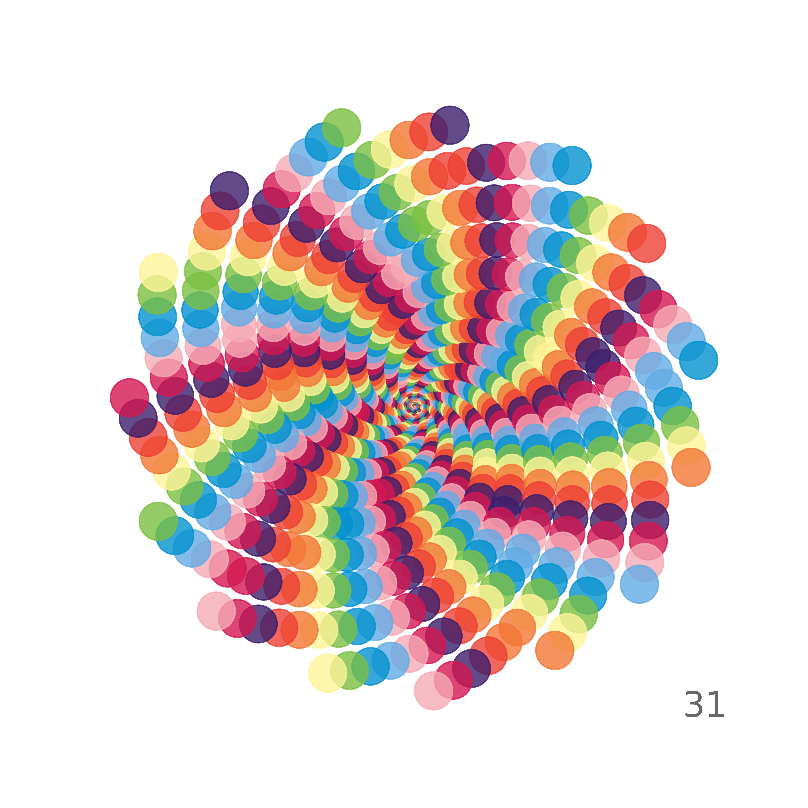
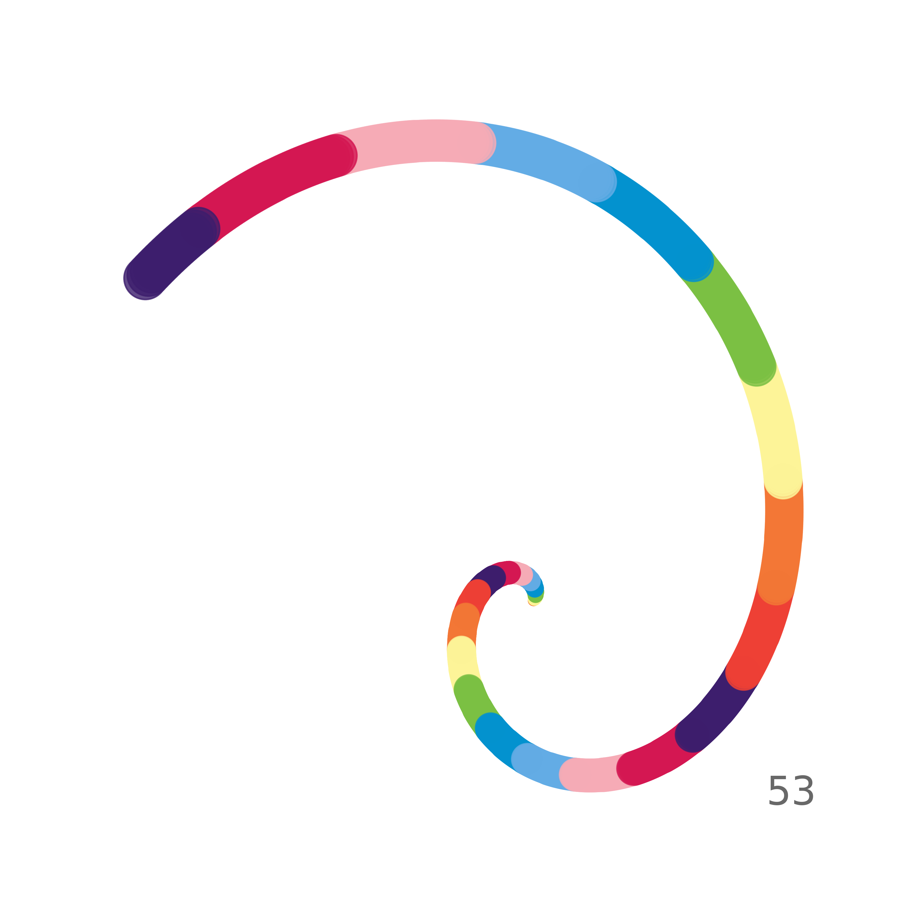
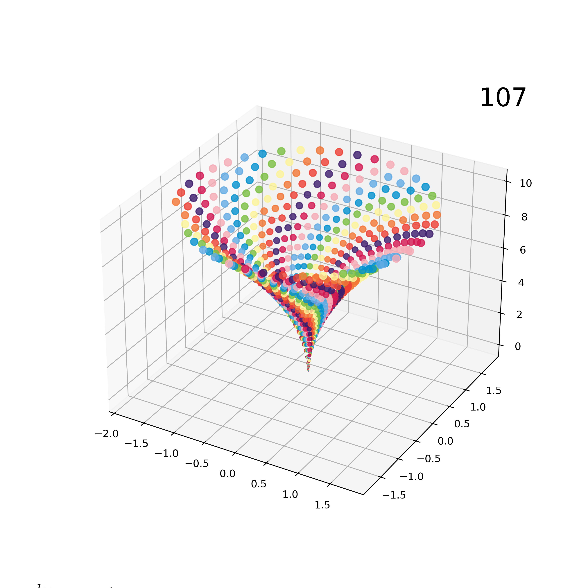
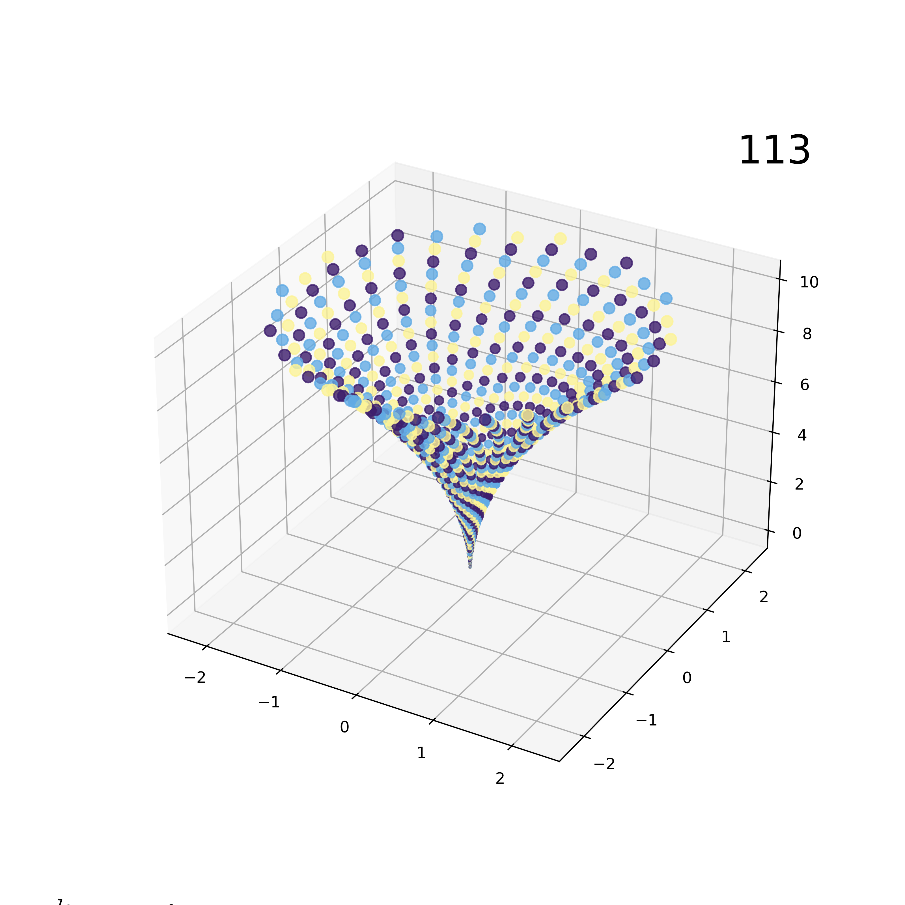
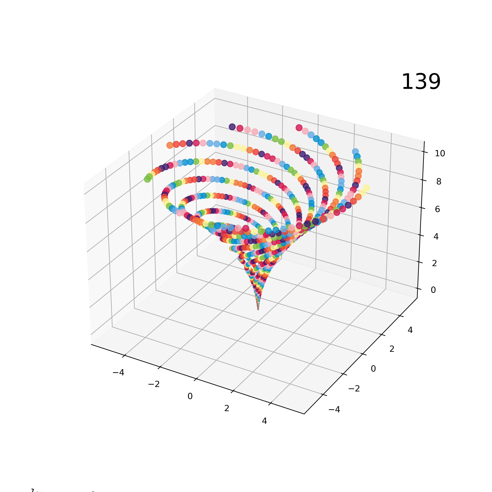

## Prime Spirals
Generate an infinite number of spirals using any integer sequence and colour palette. Can be created in 2d or 3d. Primes are used because they create fascinating spirals and are a wonderful area of study. 

### Showcase
For hundreds of spirals generated from primes between 2 and 10000, check out https://primespirals.github.io/

### Requirements & Packages
* Python 3.7+ (tested on 3.11)
* Set up venv then: $ pip install -r requirements.txt 

### 2D Examples
Used phi and pi as degree modifiers and a set colour palette. 

Spirals can be all sorts of shapes and colours.

Some show interesting repeating patterns. 

Some are totally wild.

### 3D Examples
Plots can also be generated in 3D, and can be manipulated within matplotlib to get different viewing angles.

Some spirals are standard.

Some numbers generate fascinating colour sequences.

There's an infinite world of spirals generated from primes, each batch as interesting as the next. 
